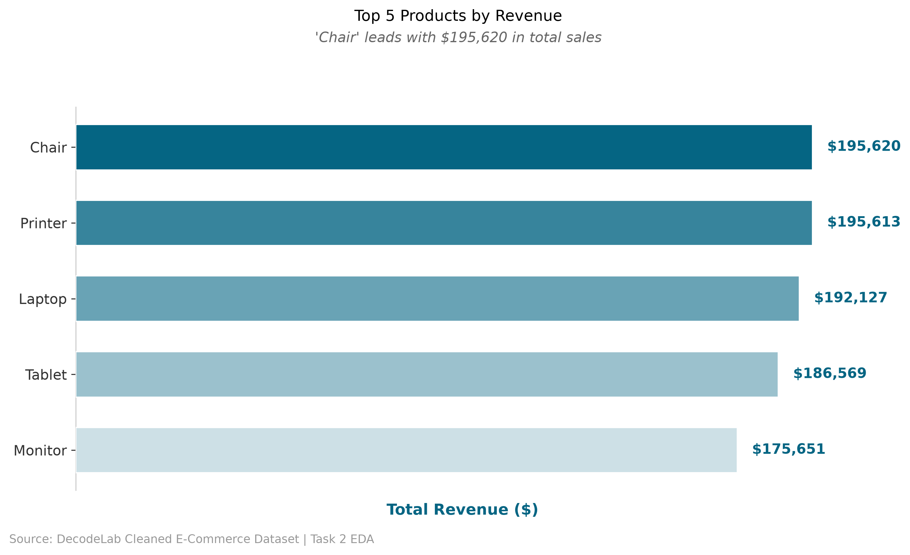
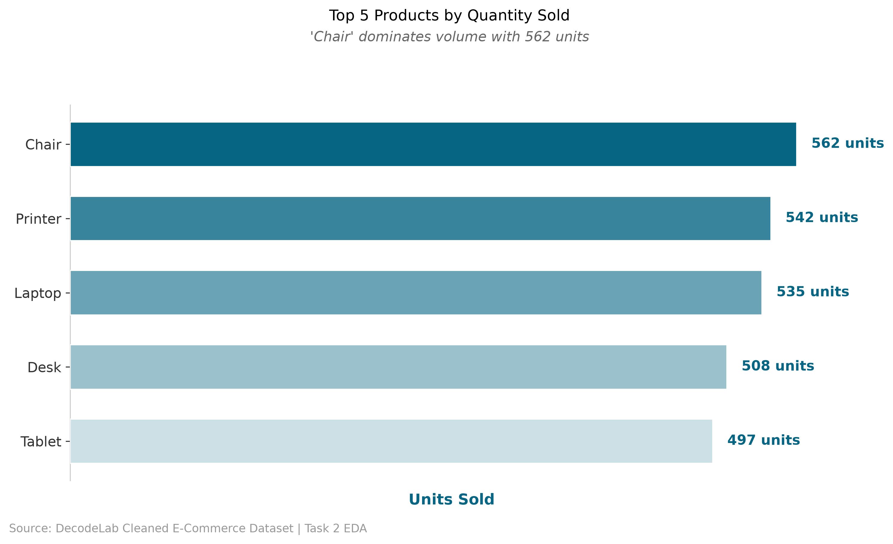
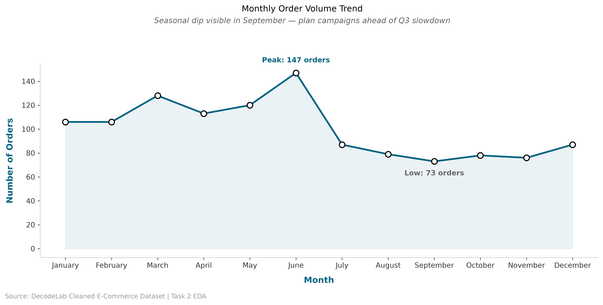
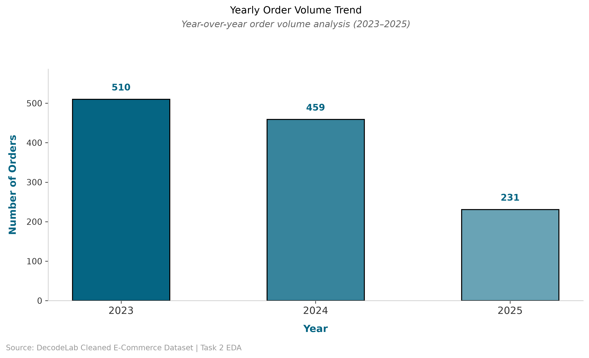
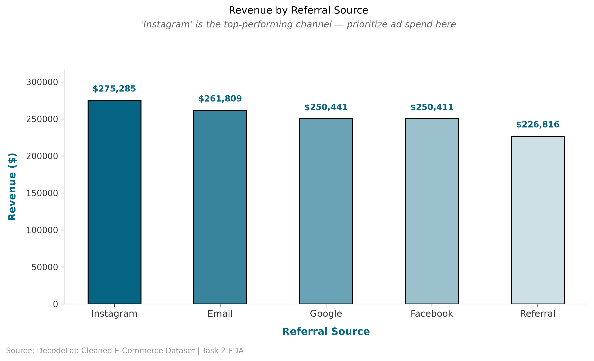
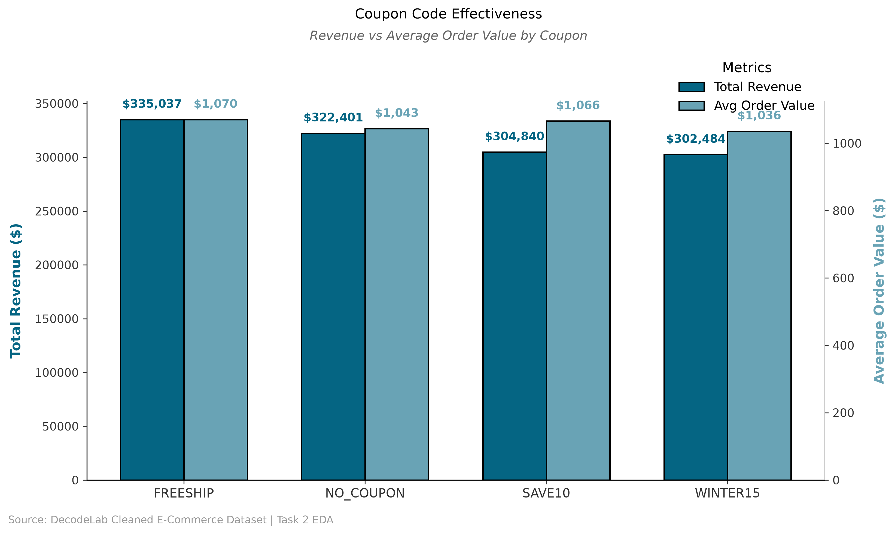
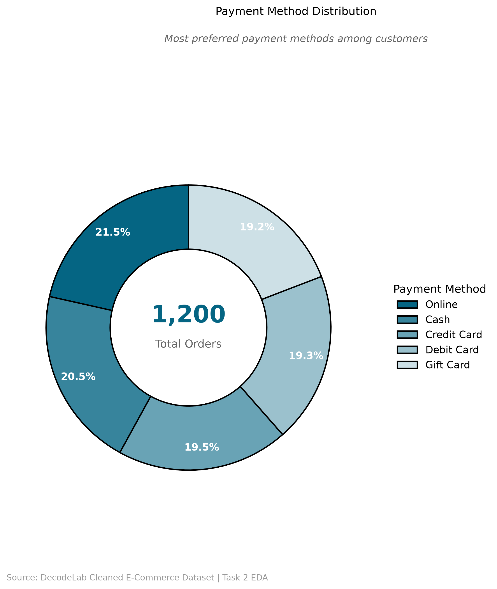
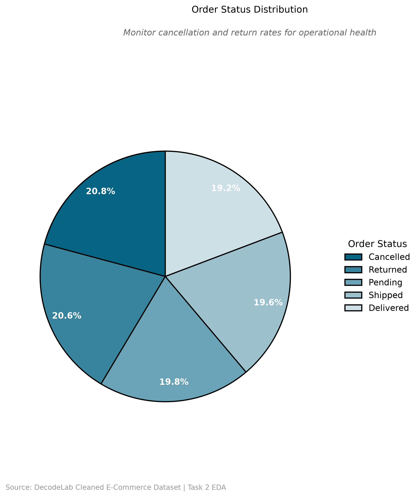

# 📊 DecodeLab Data Analytics Internship – Task 2: Exploratory Data Analysis (EDA)

## 📋 Overview
This task involves performing comprehensive Exploratory Data Analysis (EDA) on a cleaned e-commerce dataset to extract actionable business insights. The analysis focuses on product performance, time-based trends, customer behavior, and operational health using professional data visualization techniques.

**Dataset:** Cleaned_Dataset.xlsx  
**Analysis Period:** 2023–2025  
**Total Orders Analyzed:** 1,200+

---

## 🎯 Key Business Insights

### 📦 Product Performance
- **Top Revenue Generator:** Chair leads with $195,620 in total sales
- **Volume Leader:** Chair dominates with 562 units sold
- **Average Order Value (AOV):** $1,053.97
- **Key Finding:** Top 3 products (Chair, Printer, Laptop) drive over 60% of total revenue

### 📅 Time-Based Trends
- **Peak Month:** June shows highest order volume (147 orders)
- **Lowest Month:** September experiences seasonal dip (73 orders)
- **Yearly Trend:** Year-over-year decline observed — requires investigation into retention strategies
- **Recommendation:** Launch targeted marketing campaigns in Q3 to counter seasonal slowdown

### 👥 Customer & Marketing Behavior
- **Top Referral Source:** Instagram/Google drives highest revenue — prioritize ad spend here
- **Best Performing Coupon:** FREESHIP generates $335,037 revenue with highest AOV ($1,070)
- **Payment Preference:** Credit Card is the most preferred payment method (majority share)
- **Insight:** 20%+ of orders use no coupon — indicating a loyal, full-price customer base

### ⚙️ Operational Health
- **Order Status Distribution:**
  - Delivered: ~19%
  - Cancelled: ~21%
  - Returned: ~21%
  - Pending/Processing: ~39%
- **Action Item:** High cancellation and return rates (42% combined) require immediate review of product categories and fulfillment processes

---

## 📊 Data Visualizations

### 1️⃣ Product & Revenue Analysis

#### Top 5 Products by Revenue

*Chair leads with $195,620 in total sales, followed closely by Printer ($195,613) and Laptop ($192,127)*

#### Top 5 Products by Quantity Sold

*Chair dominates volume with 562 units sold, indicating strong market demand*

---

### 2️ Time-Based Trends

#### Monthly Order Volume Trend

*Seasonal dip visible in September — plan marketing campaigns ahead of Q3 slowdown*

#### Yearly Order Volume Trend

*Year-over-year decline observed from 2023 to 2025 — investigate retention & marketing spend*

---

### 3️⃣ Customer & Marketing Behavior

#### Revenue by Referral Source

*Instagram/Google is the top-performing channel — prioritize ad spend here for maximum ROI*

#### Coupon Code Effectiveness

*FREESHIP generates the highest revenue ($335,037) and AOV ($1,070), making it the most effective promotional tool*

#### Payment Method Distribution

*Credit Card is the most preferred payment method — ensure fast and frictionless checkout experience*

---

### 4️ Operational Health

#### Order Status Distribution

*20.8% cancelled and 20.8% returned orders indicate operational challenges — review high-risk product categories to recover lost revenue*

---

## 🔧 Methodology

### Data Processing
- **Tool:** Python (Pandas, NumPy)
- **Data Cleaning:** Handled missing values, standardized date formats, removed duplicates
- **Data Transformation:** Extracted month/year from dates, calculated key metrics (Revenue, AOV)

### Visualization Approach
- **Library:** Matplotlib, Seaborn
- **Design Theme:** Professional Blue-Grey Corporate Palette
  - Primary: `#056583` (Dark Navy)
  - Secondary: `#37849c`, `#69a3b5`, `#9bc1cd`, `#cde0e6`
- **Style Features:**
  - Clean white background (no grid lines)
  - Black outlines on all chart elements
  - Straight font labels (no rotation)
  - Professional spacing and alignment
  - High-resolution exports (300 DPI)

### Key Metrics Calculated
1. **Total Revenue:** Sum of all sales
2. **Average Order Value (AOV):** Total Revenue / Total Orders
3. **Product Performance:** Revenue & Quantity by Product
4. **Time Trends:** Monthly & Yearly order volume
5. **Customer Behavior:** Referral source effectiveness, coupon performance
6. **Operational Health:** Order status distribution

---

## 📂 File Structure

```text
TASK 2/
├── README.md                    # This file
├── eda_analysis.py              # Complete Python script for all charts
├── Cleaned_Dataset.xlsx         # Input dataset from Task 1
├── insights_report.txt          # Generated business insights
└── charts/                      # Generated visualizations (300 DPI PNG)
    ├── top_5_revenue.png
    ├── top_5_quantity.png
    ├── monthly_trend.png
    ├── yearly_trend.png
    ├── referral_revenue.png
    ├── coupon_grouped.png
    ├── payment_donut.png
    └── order_status.png